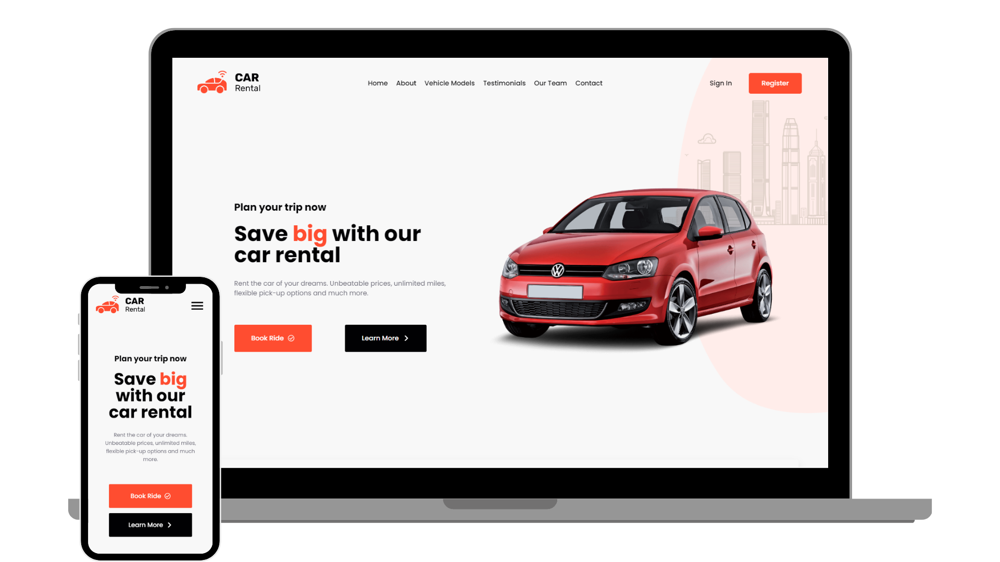

<h2 align="center">
  Car Rental  
  <a href="https://car-rental-rashidov.netlify.app/" target="_blank">Netlify</a>
  <a href="https://car-rental-rashidov.vercel.app" target="_blank">Vercel</a>
</h2>

  

<h3 align="center">
    🔹
    <a href="https://github.com/imrashidov/car-rental-project/issues">Report Bug</a> &nbsp; &nbsp;
</h3>

## Built With

- React.js
- React Router

## Features

**🎨 Styled with CSS**

**📱 Fully Responsive**

## 🛠 Installation and Setup Instructions

1. Installation: `npm install`

2. In the project directory, you can run: `npm start`

Runs the app in the development mode.\
Open [http://localhost:3000](http://localhost:3000) to view it in the browser.
The page will reload if you make edits.

### Show your support

Give a ⭐ if you like this website!

